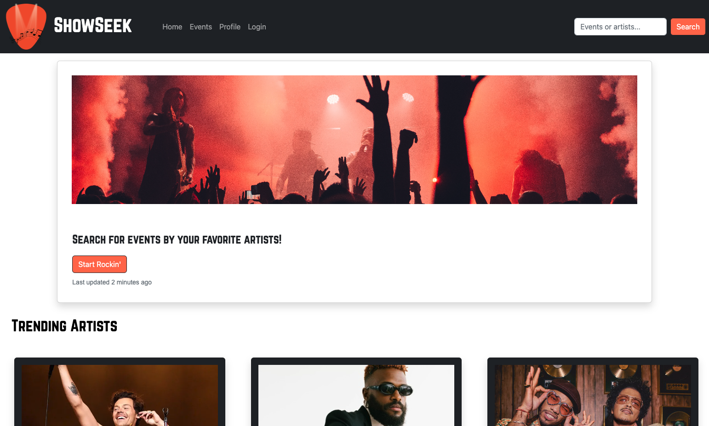
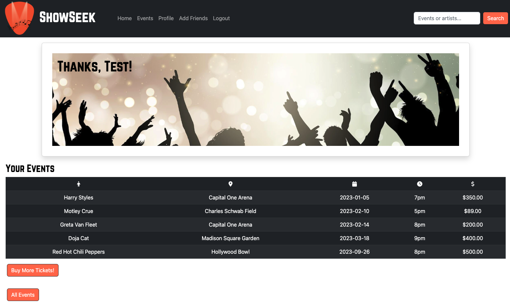
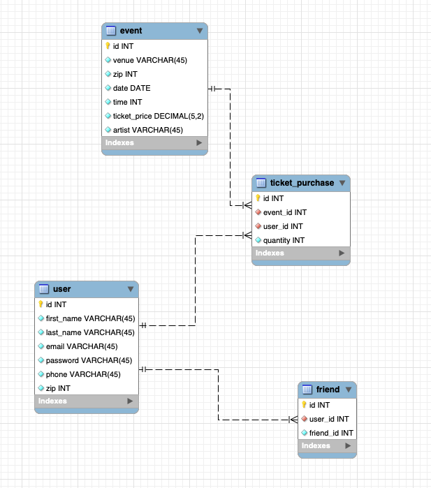

# Java Developer Case Study - Kalyn Howes

Overview
=
ShowSeek is a website for locating events and adding friends. 

Public Pages:
- Home: displays trending artists 
- Events: order events based on their characteristics, buy tickets when logged in
- Login / Create User: login directly or choose to create a new user
- Create User: enter information to join ShowSeek
- Error 404: page can not be found error

Secured Pages: 
- Profile: displays current user info, their saved events, and their friends list
- Add Friends: search for users by name and add them as friends
- Ticket Purchase: choose the event and ticket quantity
- Complete Purchase: shows the event was added to the user and lists all of their events
- Settings: change user password
- Admin: tests administrative functionality

Tools Used
===
- SpringBoot Framework (Java)
    - Spring Security
    - Hibernate
    - Apache Tomcat Web Server
    - Lombok
    - Javax Servlet
- HTML/CSS, JavaScript, Ajax
- JSP and JSTL Tags
- Trello Board: https://trello.com/b/va4cMkbs/showseek-capstone
- MySQL for DBMS

Deployment
==
- The current repository includes all files from TEKSystems training. The folder entitled "Capstone" is all that is needed to run this project.
- Cloning the repo will grant access to all of these files.
- I used SpringToolSuite4 for Eclipse to run the SpringBoot Project.
- Run ShowSeekApplication.java as a java application. This is located under src/main/java in the com.capstone.ShowSeek package.
- The above will automatically start SpringBoot and from here the website can be accessed using the localhost: http://localhost:8080/ 

Notes
==
- Logging has been implemented using Lombok. Logs are shown on the SpringBoot Console when each page is being accessed to keep a chronological access memory log.
- Some read methods created for pulling data from the database are brute-force and will not operate well in large-level production in their current state. 
- Search bar in navigation bar is NOT implemented. It is there for only looks at the moment.

## Future Implementations
- Recommending events based on previously bought tickets and events that friends are attending.
- Show Spotify previews based on saved events.
- Automatic location proximity results. Google Map integration. 
- Notifications when a friend buys tickets to an event, tickets go on sale, etc.
- Link with Google to add events directly to a Google Calendar.
- Ticket purchase options through Ticketmaster, SeatGeek, etc.

